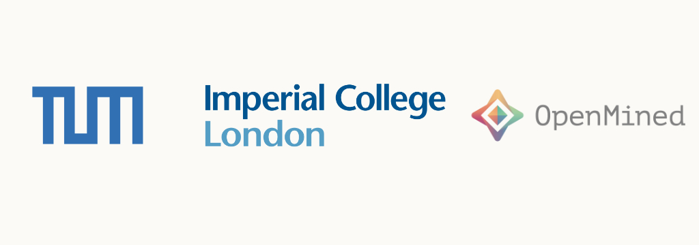

# MICCAI 2021 PPML Workshop and Tutorial

## Workshop Scope

Despite substantial advances in the field of machine learning for medical imaging, clinical translation of AI techniques is still constrained by the lack of sufficiently large, representative and unbiased datasets. The primary cause of this challenge can be identified as the strict regulation of confidential patient data, alongside ethical and moral considerations of the medical profession. 

Privacy-preserving Machine Learning (PPML) can offer regulation-compliant solutions, enabling the simultaneous utilisation and protection of sensitive datasets. So far, only federated learning has seen widespread attention in the field. However, federated learning on its own is an insufficient measure of privacy protection, as witnessed by a mounting body of literature on successful privacy attacks leading to partial or catastrophic loss of privacy.

The proposed tutorial, complementing the workshop on the same subject, will introduce participants to the computational techniques of PPML. Participants will gain hands-on experience training deep neural networks with differential privacy and secure multi-party computation, as well as performing end-to-end encrypted inference.

The tutorial is organised collaboratively between TU Munich, Imperial College London and OpenMined.

## Participant Information

The tutorial is open to participants at all levels of experience and explicitly designed for beginners in PPML. Participants are, however, expected to be familiar with training deep neural networks in computer vision tasks.

Due to the high probability of the event being online, we expect participants to bring their own computer. A GPU is explicitly *not* required, as we will be using datasets suitable for CPU training.

In preparation for the tutorial, we kindly ask participants to install the [PriMIA](https://github.com/gkaissis/PriMIA) and [deepee](https://github.com/gkaissis/deepee) libraries in two separate virtual environments. We strongly encourage the utilisation of the conda package manager.

In preparation for the tutorial, participants are encouraged to visit https://courses.openmined.org and https://www.udacity.com/course/secure-and-private-ai--ud185 to learn the basics of privacy-preserving machine learning using free courses offered by OpenMined.

The concrete outline of topics that will be covered is as follows:
- PriMIA: Setup and introduction to the system model. Setting up Data Owner Worker Nodes and Central Servers. 
- PriMIA: Introduction to PPML learning with PriMIA.
- PriMIA: Worked examples 
- deepee: Introduction to differential privacy in the context of deep learning
- deepee: Discussion on the importance of model choice, hyper-parameter selection and the privacy-utility trade-off
- deepee: Practical differentially private deep learning.

The tutorial will be framed by short-form lectures introducing the pertinent topics.

Participants are able to take advantage of mentoring by the OpenMined team by joining the OpenMined Slack Channel.
## Schedule (Preliminary - time slots are subject to (and will probably) change!)

| Time | Event |
| --- | --- |
| 08:00 - 08:30 | Introduction to PPML with PriMIA and theoretical background. |
| 08:30 - 10:00 | Live coding: example using [PriMIA](https://github.com/gkaissis/PriMIA) |
| 10:00 - 10:15 | Break |
| 10:15 - 11:00 | Intro to differential privacy |
| 11:00 - 12:00 | Live coding: Privacy-preserving deep learning using [deepee](https://github.com/gkaissis/deepee) |

## Organisers
- Georgios Kaissis, Technical University of Munich, Imperial College London, OpenMined
- Emma Bluemke, University of Oxford, OpenMined
- Daniel Rueckert, Technical University of Munich and Imperial College London
- Alexander Ziller, Technical University of Munich and OpenMined
- Dmitrii Usynin, Technical University of Munich, Imperial College London, OpenMined
- Fatemehsadat Mireshghallah, University of California, San Diego and OpenMined
- Tushar Semwal, University of Edinburgh, OpenMined
- Madeleine Shang, OpenMined

## Mentoring Team
- Shaistha Fathima, OpenMined 
- Soumia Zohra El Mestari, OpenMined
- Deborah Shekinah Jacob, OpenMined 